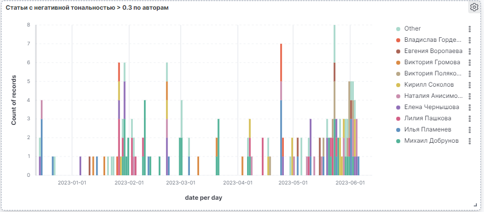

## Статистика "отрицательных" статей по авторам



```{
  "aggs": {
    "0": {
      "terms": {
        "field": "author.keyword",
        "order": {
          "2-bucket": "desc"
        },
        "size": 10
      },
      "aggs": {
        "1": {
          "date_histogram": {
            "field": "date",
            "calendar_interval": "1d",
            "time_zone": "Europe/Moscow"
          },
          "aggs": {
            "2-bucket": {
              "filter": {
                "bool": {
                  "must": [],
                  "filter": [
                    {
                      "bool": {
                        "should": [
                          {
                            "range": {
                              "tonality.negative": {
                                "gt": "0.3"
                              }
                            }
                          }
                        ],
                        "minimum_should_match": 1
                      }
                    }
                  ],
                  "should": [],
                  "must_not": []
                }
              }
            }
          }
        },
        "2-bucket": {
          "filter": {
            "bool": {
              "must": [],
              "filter": [
                {
                  "bool": {
                    "should": [
                      {
                        "range": {
                          "tonality.negative": {
                            "gt": "0.3"
                          }
                        }
                      }
                    ],
                    "minimum_should_match": 1
                  }
                }
              ],
              "should": [],
              "must_not": []
            }
          }
        }
      }
    }
  },
  "size": 0,
  "script_fields": {},
  "stored_fields": [
    "*"
  ],
  "runtime_mappings": {
    "tonality": {
      "type": "keyword"
    }
  },
  "query": {
    "bool": {
      "must": [],
      "filter": [
        {
          "range": {
            "date": {
              "format": "strict_date_optional_time",
              "gte": "now-6mon"
            }
          }
        }
      ],
      "should": [],
      "must_not": []
    }
  }
}```